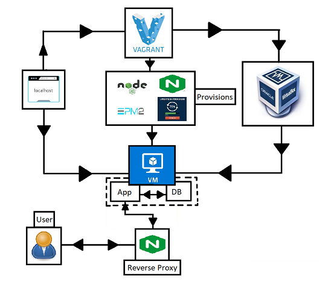

# Monolith Architecture 

A monolithic artchitecture is the traditional unified model for the design of a software program.


It is self-contained where the programs components are tightly coupled. Each component is combined into one large application and therefore have large codebases which can be difficult to maintain. 

Other parts of the code may also need to be rewritten if updates are made to a smaller portion of the code.

Benefits of Monolithic architecture include:

- Faster run-time
- Easier/faster in early stages of development

Disadvantages of Monolithic architecture include:

- Less adaptable
- Difficult to understand/debug
- Must redeploy entire application even if only fixing a single part
  
Hard to scale the application with monolithic approach, a bug in one area can also bring down the entire application.

Generally better for  smaller lightweight applications (compared to micro-services architecture).

Steps:

1. Make a directory 
2. Download app and environment folders
3. Inside the folder which contains the tests run `gem install bundler` and then `bundle`
4. Create your vagrant file
```
Vagrant.configure("2") do |config|

 config.vm.box = "ubuntu/xenial64" # Linux - ubuntu 16.04
# creating a virtual machine ubuntu 
 config.vm.network "private_network", ip: "192.168.10.100"
# once you have added private network, you need reboot VM - vagrant reload
# if reload does not work - try - vagrant destroy - then - vagrant up 

# let's sync our app folder from localhost to VM
 config.vm.synced_folder ".", "/home/vagrant/app"  

# make provision file and connect it
 config.vm.provision :shell, path: "provision.sh"


end
```
5. Create a provision file installing dependencies(must end in .sh)
```
# updates ubuntu
sudo apt-get update

sudo apt-get upgrade -y

# nginx install
sudo apt-get install nginx -y
sudo systemctl enable nginx
sudo systemctl start nginx

# nodejs install
sudo apt-get purge nodejs npm
curl -sL https://deb.nodesource.com/setup_6.x | sudo -E bash -
sudo apt-get install -y nodejs

# pm2 install
sudo npm install pm2
```
6. Enter `vagrant up` to create your vm.
7. Enter `rake spec` inside your tests directory 
8. Enter `vagrant ssh` to connect to your vm in the directory with the vagrant file
9. Navigate to where the app.js file is located
10. Use command `npm install` 
11. Use command `npm start`
12. The app should now be working. 


### Linux Variable & Env Variable in Linux - Windows - Mac
- How to check existing Env Var `env` or `printenv`
- How to create a var in linux `Name=Sam`
- How to check Linux variables `echo $Name` 
- Env var we havea a key word called `export var=val`
- Check specific env var `printenv Last_Name`

### How to save Env Variables
- Research how to make env persistent of your first name last name
- and `DB_HOST=mongodb://192:168:10:150:27017/posts`
- Set environment variables inside with `export First_Name=Sam`
- `source ~/.bashrc` to refresh


## Creating Multiple VM's



Configure Vagrantfile as such:

- Ensure Vagrant file is configured as such.
```
Vagrant.configure("2") do |config|
    
    config.vm.define "app" do |app| # creates the app vm 

        # creating a virtual machine ubuntu 
        config.vm.box = "ubuntu/xenial64" # Linux - ubuntu 16.04 
        
        # configures the private network
        config.vm.network "private_network", ip: "192.168.10.100"

        # syncs our app folder from localhost to VM
        config.vm.synced_folder ".", "/home/vagrant/app"  

        # make provision file and connects it
        config.vm.provision :shell, path: "provision.sh"
    end

    # makes the database virtual machine
    config.vm.define "db" do |db|
        # creates the vm using ubuntu bionic 64
        db.vm.box = "ubuntu/bionic64"
        # sets the private network connection
        db.vm.network "private_network", ip: "192.168.10.150"

    end
 end
```
### How to Automate Reverse Proxy
1. Create reverse proxy file.
```
server {
        listen 80 default_server;
        listen [::]:80 default_server;

        root /var/www/html;

        
        index index.html index.htm index.nginx-debian.html;

        server_name _;

        location / {
                proxy_pass http://localhost:3000;
        }

}

```
2. Update provision file.
```
# updates ubuntu
sudo apt-get update
sudo apt-get upgrade -y

# nginx install
sudo apt-get install nginx -y
sudo systemctl enable nginx
sudo systemctl start nginx

# nodejs install
sudo apt-get purge nodejs npm
curl -sL https://deb.nodesource.com/setup_6.x | sudo -E bash -
sudo apt-get install -y nodejs

# pm2 install
sudo npm install pm2 -g

# automate 
sudo cp -f app/rev_prox_file /etc/nginx/sites-available/default
sudo systemctl restart nginx

```
3. Reload/Up the App VM
4. Go into the app directory and run using `npm install` and `npm start`. 

